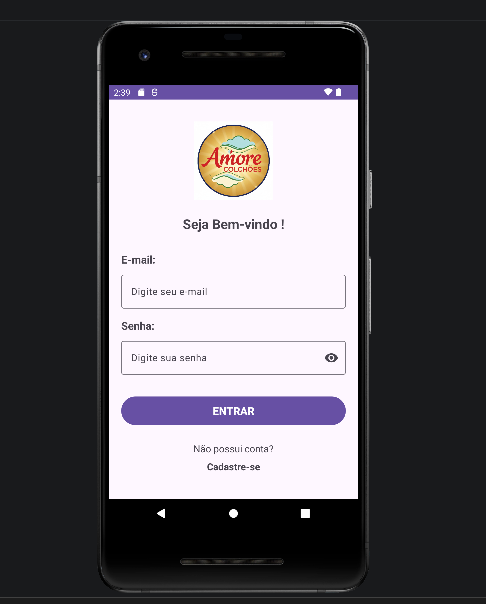
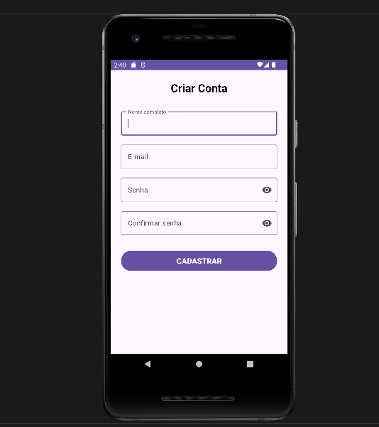
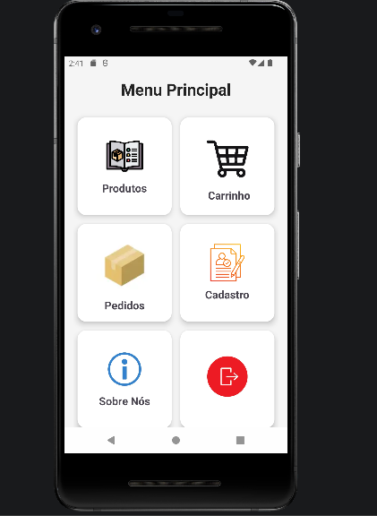
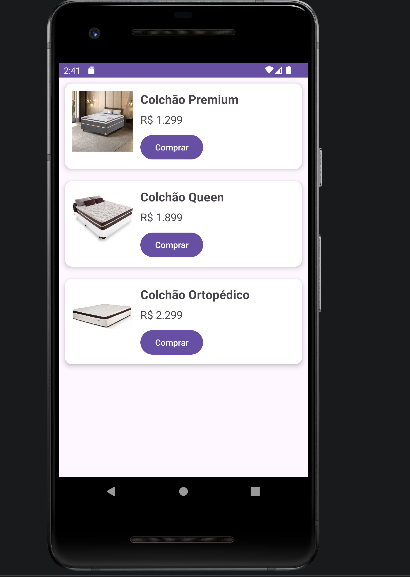
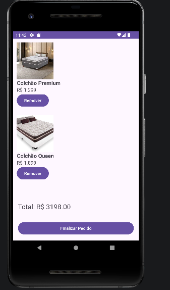
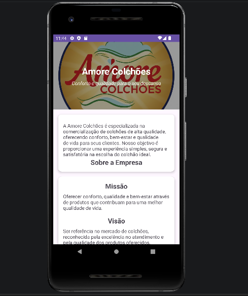

# App Amore Colchões

Aplicativo Android desenvolvido em Java utilizando Android Studio para gerenciamento e venda de colchões.

## Funcionalidades

- Login de usuários
- Cadastro de clientes
- Catálogo de produtos
- Carrinho de compras
- Histórico de pedidos
- Tela Sobre Nós
- Navegação por menu inferior

## Tecnologias Utilizadas

- Java
- Android Studio
- SQLite
- Material Design
- CardView
- ConstraintLayout

## Telas do Sistema

### Login

### Cadastro 

### Menu Principal

### Produtos

### Carrinho

### Sobre Nós

## Autor

Ruan Machado

Projeto acadêmico desenvolvido para fins de estudo e prática de desenvolvimento Android.
